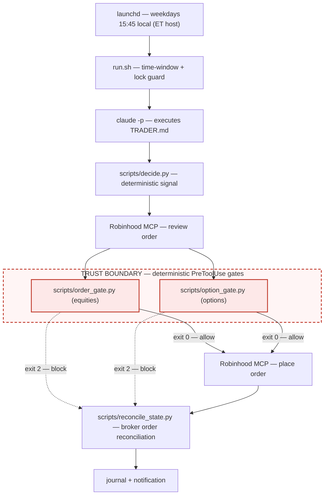

# agentic-trader

[](https://github.com/DylanMcCavitt/agentic-trader/actions/workflows/ci.yml)

An autonomous trading agent: a scheduled, headless Claude Code session that
trades through a broker MCP (Robinhood's official Agentic Trading connector),
with safety enforced by **deterministic, model-independent guardrails** rather
than by trusting the model. The trading strategy is a pluggable worked example
— what this repo is really about is the harness.



## How a run works

`launchd` (com.example.agentic-trader, weekdays 15:45 local on an ET host) →
`run.sh` (time-window + lock guard) → `claude -p` executes [`TRADER.md`](TRADER.md) →
`scripts/decide.py` computes the signal → Robinhood MCP reviews/places orders
→ broker-order reconciliation updates state → journal + macOS notification.

> **Scheduler timezone requirement:** install and run this LaunchAgent only on
> an Eastern Time host (`America/New_York` or an equivalent IANA/legacy ET zone).
> `launchd` `StartCalendarInterval` is evaluated in the Mac's machine-local timezone;
> `run.sh` then enforces the 15:30–15:58 ET trading window. Non-ET installs are
> refused, and a non-ET scheduled run logs a `WARN: host-TZ mismatch` entry to
> `logs/runner.log` instead of looking like a normal outside-window skip.

The model never decides *what* to trade. It orchestrates: fetch a quote,
check the position, call the decision script, place (or not place) one order,
and write the journal. Canonical state fields are written by deterministic
scripts, not by model prose. Every step that matters is checked by code it
cannot edit or bypass.

## Trust model: guardrails, not vibes

The premise: an LLM is a capable operator but an untrusted one. So every
safety property is enforced **outside the model's control** — in a PreToolUse
hook, in file permissions, in tracked config — never by prompt instructions
alone. Nine guardrail layers, all deterministic:

1. **Dry-run by default.** `config.json` ships with `dry_run: true`; the gate
   blocks every live order until you deliberately flip it. Orders are still
   reviewed and journaled, so you can watch the agent work risk-free.
2. **A deterministic PreToolUse order gate.** `scripts/order_gate.py` is wired
   as a Claude Code hook on `place_equity_order`. It is plain Python the
   harness runs *before* the tool call executes — the model cannot skip it,
   argue with it, or edit it (the settings do not allow direct model edits to
   `state/`; state mutations happen through whitelisted `uv run` scripts).
   Exit 2 blocks the order; it also **fails closed**: a missing or unparsable
   `config.json` or `state/state.json` blocks outright.
3. **Symbol + account whitelist.** Orders for any symbol other than the one
   configured, or any account other than the configured agentic account, are
   blocked. The real account number lives only in untracked
   `config.local.json`; until it exists, every order is hard-blocked.
4. **Per-order dollar cap.** Buys must be market orders sized in dollars and
   at most `max_order_usd`.
5. **One order per day.** A second placement on the same day is blocked, no
   matter what the session thinks happened.
6. **Market-hours check.** Orders outside regular weekday market hours (ET)
   are blocked.
7. **Drawdown kill switch with manual reset.** If portfolio value falls
   `kill_drawdown_pct` below its high-water mark, `halt: true` is set in
   `state/state.json` and the gate blocks all trading until a human resets it.
8. **Broker-sourced state reconciliation.** After every decision/order attempt,
   `scripts/reconcile_state.py` writes `last_action` / `last_option_action`
   from the broker order list matched to the same-day gate marker `ref_id`. If
   the broker has no matching order, `order_placed` is written `false`.
9. **Audit journal of every run.** Each run appends one entry to
   `logs/journal.md` — signal JSON, action taken (or the blocked/DRY-RUN
   reason), order id and fill state — so there is a paper trail even for runs
   that did nothing.

The gate is the trust boundary. [`TRADER.md`](TRADER.md) reinforces it from
the prompt side — a gate block is final, and the agent is explicitly forbidden
from retrying with altered parameters to get around it — but the guarantee
never depends on the model obeying. Beyond the gate, the broker side is its
own sandbox: the MCP can only trade in the dedicated agentic account, and that
account's funding is the hard loss cap.

## `.claude/settings.json` is the feature

The headline of this repo is its [`.claude/settings.json`](.claude/settings.json),
published as-is. It wires the harness:

- **PreToolUse hooks**: matcher `mcp__.*place_equity_order` runs
  `scripts/order_gate.py`, and `mcp__.*place_option_order` runs
  `scripts/option_gate.py`, before any order placement reaches the broker.
- **Allow/deny permissions**: the session may read the repo, write only
  `logs/**` directly, and run a short whitelist of commands (`uv run`,
  `osascript`, `uuidgen`, `date`, `sleep`) plus the Robinhood MCP. Direct
  model edits to `state/**` are denied; state is mutated by deterministic
  scripts invoked through `uv run`. Reads of `~/.secrets/**` and `.env` files
  are denied.

That file, plus `run.sh`'s `--permission-mode dontAsk --max-turns 40`, is the
whole containment story: a headless agent with real-money tools, boxed in by
configuration the agent cannot modify.

## The strategy is pluggable

The agent consumes a single decision interface:

```
uv run scripts/decide.py --price <live_price> --holding <true|false>
```

→ decision JSON: `{"decision": "BUY" | "SELL" | "HOLD" | "NONE", "reason": ...}`

The shipped implementation is Connors RSI(2) mean reversion on SPY,
long-only. Swap in any strategy that honors the same contract and nothing
else in the harness changes — the guardrails apply regardless of what
produces the signal. Full rules, parameters, and backtest methodology:
[`docs/strategy.md`](docs/strategy.md).

### The paper fleet

Alongside the live strategy, every run forward-tests a fleet of 10
candidate strategies — 5 equity, 5 single-leg options — each in its own
$10k paper book (`scripts/run_strategies.py` → `state/paper.json` +
`logs/paper.md`). The fleet never places real orders; it exists so dry-run
weeks compare ten candidates instead of validating one. Rank them with
`uv run scripts/scoreboard.py`. Full lineup and promotion path:
[`docs/strategies.md`](docs/strategies.md).

Options orders have their own deterministic PreToolUse gate
(`scripts/option_gate.py`, wired to `place_option_order`): long-only —
buy-to-open / sell-to-close, never short premium — limit-only opens, a hard
premium cap (`max_option_premium_usd`), a contract cap, one option order
per day, and the same dry-run/halt/account/fail-closed rules as the equity
gate.

Honest framing, kept on purpose: the backtest does **not** beat buy-and-hold
(SPY 1993–2026: 4.9% CAGR vs 10.8% for buy-and-hold). Its appeal is high
per-trade expectancy with low exposure and shallow drawdowns — Sharpe 0.79,
max drawdown −14.8%, 77% win rate, ~8 trades/yr, 14% market exposure.
Reproduce with `uv run scripts/backtest.py`.

## Setup

Dependencies are managed by a root `pyproject.toml` + committed `uv.lock`
(pandas, yfinance; pytest in the dev group). `uv sync` from a clean checkout
builds the env; `uv run scripts/<x>.py` resolves against the project env
automatically.

- Install the scheduler from an Eastern Time host only: `bash scripts/install-launchd.sh`
  — substitutes this repo's path into `com.example.agentic-trader.plist`,
  installs it to `~/Library/LaunchAgents/`, and loads it. The installer refuses
  non-ET hosts because `launchd` schedules in machine-local time. Safe to re-run.
- The weekday 15:45 schedule is intentional: the signal is computed at
  ~3:45pm ET using the live price as a provisional close, so orders can fill
  before the 4pm close. Don't change it without revisiting the strategy.
- First-run bootstrap: `cp state/state.example.json state/state.json`, and
  create `config.local.json` with the real account number. Until both exist,
  the order gate blocks every order (fail closed).

## Files

- [`.claude/settings.json`](.claude/settings.json) — hook wiring + permissions
  (see above)
- `TRADER.md` — the exact procedure the headless session follows
- `scripts/order_gate.py` / `scripts/option_gate.py` — the deterministic
  order gates (PreToolUse hooks) for equity and option orders
- `scripts/reconcile_state.py` — deterministic broker-order-to-state
  reconciliation after each decision/order attempt
- `scripts/decide.py` — the decision interface implementation
- `scripts/backtest.py` — backtest harness (same indicator math as decide.py)
- `scripts/run_strategies.py` — the paper fleet: evaluates all 10 candidate
  strategies into per-strategy paper books (`state/paper.json`,
  `logs/paper.md`); `scripts/scoreboard.py` ranks them;
  `scripts/backtest_fleet.py` replays the same signals over decades of
  history (options via a documented Black-Scholes approximation) —
  see [`docs/strategies.md`](docs/strategies.md)
- `config.json` — symbol, sizing caps, dry_run flag, and shared strategy
  params; `config.local.json` (untracked) deep-merges over it and holds the
  real account number — see [`docs/config.md`](docs/config.md) for the full
  reference; `config.example.json` is a copyable starting point
- `state/state.json` — untracked live state: high-water mark, halt flag,
  and broker-reconciled last action
- `logs/journal.md` — one entry per run; `logs/runner.log` — scheduler output

## Ops

- Pause: `launchctl bootout gui/$UID/com.example.agentic-trader`
- Resume: `launchctl bootstrap gui/$UID ~/Library/LaunchAgents/com.example.agentic-trader.plist`
- The Mac must be configured for Eastern Time and awake at 3:45pm ET; launchd
  fires a missed run on wake but `run.sh` skips it outside 15:30–15:58 ET.
- Kill-switch reset: after a drawdown halt, set `halt: false` in
  `state/state.json` by hand — nothing resets it automatically.
- Re-auth: if the claude.ai Robinhood connector token expires, runs will
  journal MCP errors — reconnect via claude.ai → Settings → Connectors.

## Disclaimer

This project is educational/reference software for studying agentic trading
harnesses. It is not investment advice, and nothing in this repository is a
recommendation to buy or sell any security. When `dry_run` is set to `false`
in `config.json`, it trades real money in a live brokerage account — losses
are entirely possible and entirely yours. If you run it live, use a dedicated
brokerage account funded only with money you can afford to lose; the account
balance is the hard loss cap. The software is provided without warranty of any
kind (see [LICENSE](LICENSE)). The shipped default is the safe configuration:
`dry_run: true`, so no orders are ever placed until you deliberately change it.
